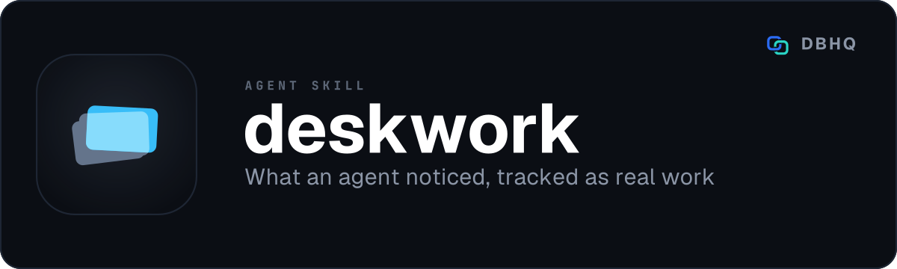

<div align="center">



# deskwork

**What an agent noticed, tracked as real work**

[](LICENSE)
[](https://code.claude.com/docs/en/plugins)
[]()

A free, open-source tool by [DBHQ](https://dbhq.uk) - documented at [skills.dbhq.uk](https://skills.dbhq.uk/deskwork/)

</div>

---

File what an agent notices as tracked work on GitHub - and keep a roadmap in git that says what comes next and why.

An agent skill for [Claude Code](https://code.claude.com) and [Codex](https://developers.openai.com/codex/cli). File a side issue mid-task without stopping, link designs to the issues that track them, reason about work order, and render a roadmap from the dependency graph.

## What makes it different

Three things happen in most agent workflows and none of them survives the session:

1. An agent finds a side issue while doing something else, mentions it, and it is gone.
2. An idea or a design gets written into a spec file and nothing tracks whether it was acted on.
3. Nobody can say what order open work should be done in because dependencies are stated in prose, not declared.

deskwork closes all three. It files the side issue, links the design file to an issue that tracks it, and reasons about precedence, writing the conclusion back to GitHub as real dependency links.

## Install

### As a Claude Code plugin (recommended)

```
/plugin marketplace add dbhq-uk/marketplace
/plugin install deskwork@dbhq
```

### Any agent (Cursor, Copilot, Windsurf, Gemini, Cline and more)

```bash
npx skills add dbhq-uk/deskwork-skill
```

The [skills.sh](https://skills.sh) CLI installs into whichever agent directories
it finds, so this works outside Claude Code and Codex too.

### Local install (Claude Code or Codex)

```bash
git clone https://github.com/dbhq-uk/deskwork-skill.git
cd deskwork-skill
./install.sh          # Claude Code: symlinks into ~/.claude/skills (edits are live)
./install-codex.sh    # Codex: installs into ~/.codex/skills
```

[`install.sh`](install.sh) and [`install-codex.sh`](install-codex.sh) are the
same install two ways: Claude Code substitutes `${CLAUDE_SKILL_DIR}`, so the
whole skill directory is symlinked untouched, while Codex does not, so its
`SKILL.md` is rewritten at install time. Re-run the Codex one after editing
`SKILL.md`.

## Requirements

Python 3, standard library only. `git`, and `gh` authenticated - every verb
here reads or writes GitHub issues.

## Opt in, per repository

deskwork does nothing at all until a repository has a `.github/deskwork.toml` saying `enabled = true`. Write a starter:

```bash
python3 ~/.claude/skills/deskwork/scripts/deskwork.py init
```

Full field reference: [`skills/deskwork/references/projects-v2.md`](skills/deskwork/references/projects-v2.md).

## The six modes

All require the working directory to be inside a git repository with `deskwork.toml` present and `enabled = true`.

### capture - file a new issue

```bash
python3 ~/.claude/skills/deskwork/scripts/deskwork.py capture \
  --title "Retry logic drops the last attempt" \
  --type Bug \
  --area infra
```

Searches for similar issues and shows them to you, creates the issue if you proceed, adds it to the board, and sets its status to Triage. The issue type and area are optional.

### review - reconcile the dependency graph

```bash
python3 ~/.claude/skills/deskwork/scripts/deskwork.py review
```

Reads every open issue and its existing dependency links. Reports what is ready to start, what is blocked, any cycles, and decomposition candidates (large issues that might split). An agent reasons about what should block what; you review and approve; the script writes on approval.

### roadmap - render the roadmap

```bash
python3 ~/.claude/skills/deskwork/scripts/deskwork.py roadmap
```

Builds the dependency graph and renders `roadmap.md` in the repository root. The roadmap shows what is ready, what is blocked, and what is still in Triage (not yet reasoned). Every dependency shown is a declared GitHub link.

### init - set up the board

```bash
python3 ~/.claude/skills/deskwork/scripts/deskwork.py init
```

Creates the declared labels, fields and statuses. Idempotent - safe to re-run after a config change. This is how a new repository is onboarded in one command.

### intake - add existing issues to the board

```bash
python3 ~/.claude/skills/deskwork/scripts/deskwork.py intake
```

Bulk-adds existing issues that are not on the board. Needed once per repository if it has prior issue history.

### doctor - report board drift

```bash
python3 ~/.claude/skills/deskwork/scripts/deskwork.py doctor
```

Reports any drift between the board and the repository - issues missing a required field, issues absent from the board, labels present but unconfigured, and the reverse.

## The config file

`.github/deskwork.toml`. TOML, not YAML, so that no extra packages are needed.

```toml
enabled = true
project = "PVT_kwDOABCD1234"
designs = "docs/superpowers/specs/"
roadmap = "roadmap.md"
issue_types = ["Bug", "Feature", "Task"]

[labels]
area = ["website", "brand", "infra", "docs", "client"]

[fields]
Status = "Triage"
Effort = ["S", "M", "L", "XL"]
Risk = ["low", "medium", "high"]
```

The project is stored by node ID, not title. Titles are not unique; an unlinked project can conflict with a linked one. The ID is unambiguous.

`enabled = true` is required. File presence alone does not arm the skill.

## Testing

All six modes, the config parser, graph construction, cycle detection, bottleneck finding and roadmap rendering are tested without touching GitHub. Tests run against a fake `gh` shim that returns canned JSON.

```bash
python3 -m pytest skills/deskwork/tests -q
```

The fixtures deliberately include the cases most likely to produce plausible wrong answers: a cross-repository dependency edge, an issue blocking three others, an issue whose blocker has closed, a cycle in the graph, and the database-ID trap that the type system in `ids.py` exists to prevent.

**Honesty note:** No mode has ever been run against a live GitHub Project, because the `project` token scope is not granted on this machine. The logic is tested; the wiring against a real Projects v2 board is not. The code is there, the patterns are sound, but a first deployment should begin with `init` on a test repository and a human watching the board.

## What it does not do

- **It does not close issues.** A pull request can carry `Closes #N`; GitHub closes it when a human merges.
- **It does not merge.** It may propose a merge order; a human merges.
- **It does not infer dependency edges.** An edge exists because it was proposed and accepted. The reasoning is recorded with it.
- **It does not write credentials.** `gh auth` is the credential. Nothing in this repository or in `~/.dbhq/deskwork/` leaks.
- **It does not run on a schedule.** Every pass is on demand.

## Constraints

Eight things that must not break. See [AGENTS.md](AGENTS.md).

## The pair

deskwork decides what the work is and what order it goes in. [`buildwork`](https://github.com/dbhq-uk/buildwork-skill) runs it - one agent per issue, each in its own worktree, collecting the results and proposing a merge order.

Neither needs the other. buildwork reads issues and a roadmap file whoever wrote them, and falls back to open issues in no particular order while saying so.

## Design

The full design is in [`docs/superpowers/specs/2026-09-17-deskwork-design.md`](../docs/superpowers/specs/2026-09-17-deskwork-design.md), with decisions taken, prior art considered, and open items.

## Also from DBHQ

Fifteen free agent skills, all of them installable from the same marketplace and
all documented at **[skills.dbhq.uk](https://skills.dbhq.uk)**. The marketplace
itself is [dbhq-uk/marketplace](https://github.com/dbhq-uk/marketplace) - one
`/plugin marketplace add` and every one of them is available.

| Skill | What it does |
|---|---|
| [outlook](https://skills.dbhq.uk/outlook/) | Microsoft 365 mail and calendar, from the terminal |
| [trello](https://skills.dbhq.uk/trello/) | Your boards, run from your agent |
| [legwork](https://skills.dbhq.uk/legwork/) | Research that settles a decision, and says when it cannot |
| [dovetail](https://skills.dbhq.uk/dovetail/) | Checks whether your repository still agrees with itself |
| [verve](https://skills.dbhq.uk/verve/) | Strips AI tells from prose and puts a voice back |
| [vela](https://skills.dbhq.uk/vela/) | Compiler-exact code search, in any language you index |
| [garmin](https://skills.dbhq.uk/garmin/) | Your Garmin data, answered in the terminal |
| [imager](https://skills.dbhq.uk/imager/) | Images from GPT Image 2, costed before it spends |
| [gitview](https://skills.dbhq.uk/gitview/) | Which branches are finished, and safe to delete |
| [atlassian](https://skills.dbhq.uk/atlassian/) | Jira issues and Confluence pages |
| [pennyblack](https://skills.dbhq.uk/pennyblack/) | A physical letter, posted from the terminal |
| [buildwork](https://skills.dbhq.uk/buildwork/) | Your open issues, run as parallel agents |
| [groupwork](https://skills.dbhq.uk/groupwork/) | A second agent on the work, adversary or partner |

Plus [heliograph](https://skills.dbhq.uk/heliograph/), for a machine you cannot log into.

## Licence

MIT. See [LICENSE](LICENSE).
